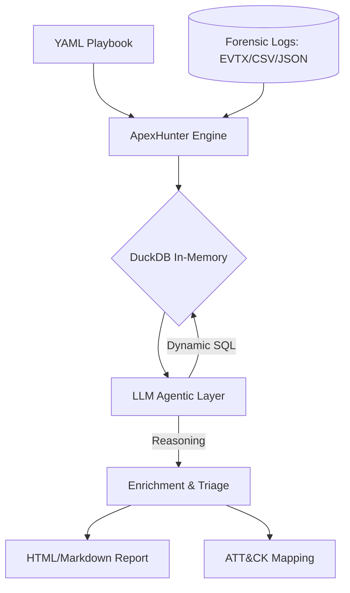

# 🎯 ApexHunter

### **Agentic Threat Hunting at Machine Speed**


**ApexHunter** is an autonomous, agentic threat hunting playbook executor designed for senior SOC analysts and DFIR professionals. It bridges the gap between static detection and intelligent investigation by executing structured YAML playbooks against forensic artifacts (EVTX, CSV, JSON, Parquet) using local LLMs for correlation, triage, and automated discovery.

---

## 🚀 Overview

In modern SOC environments, the bottleneck isn't data collection, it's the cognitive load of analysis. **ApexHunter** automates this by:
- **Offline-First Design**: Processes sensitive telemetry 100% locally on your Kali instance. No data ever leaves your air-gapped environment.
- **Agentic Reasoning**: Uses local Ollama models (Mistral, Llama3) to autonomously generate SQL queries and triage findings.
- **Forensic Power**: Native ingestion of Windows Event Logs (`.evtx`), Sysmon telemetry, and large-scale CSV/JSON exports.
- **Professional Outputs**: Generates interactive HTML dashboards, Mermaid-based execution timelines, and MITRE ATT&CK® layer mappings.

---

## ✨ Features

- **🛡️ Multi-Engine Execution**: Run SQL-standard queries via **DuckDB** for blazing-fast in-memory analysis.
- **🤖 Discovery Mode**: Define high-level hypotheses and let the LLM generate the investigation logic dynamically.
- **🔎 Forensic Ingestion**: Automatically flattens binary `.evtx` logs into queryable relational tables.
- **🔗 Intelligent Chaining**: Chain hunting steps based on previous hits or LLM-driven "is_suspicious" flags.
- **📊 Reporting**: Produces professional Markdown and dark-mode HTML reports for executive briefings.

---

## 🏗️ Architecture



---

## 🛠️ Installation

### 1. Install Ollama (Local LLM Engine)
ApexHunter requires a local [Ollama](https://ollama.com) instance to perform agentic reasoning.

- **Linux (Kali/Ubuntu)**:
  ```bash
  curl -fsSL https://ollama.com/install.sh | sh
  ```
- **macOS**:
  Download the installer from [ollama.com/download/mac](https://ollama.com/download/mac).
- **Windows**:
  Download and run the installer from [ollama.com/download/windows](https://ollama.com/download/windows).

After installation, pull the recommended model:
```bash
ollama pull mistral:latest
```

### 2. Install ApexHunter

Ensure you have **Python 3.9+** installed.

#### **Linux / macOS**
```bash
git clone https://github.com/bogdanticu88/ApexHunter.git
cd ApexHunter
python3 -m venv .venv
source .venv/bin/activate
pip install .
```

#### **Windows (PowerShell)**
```powershell
git clone https://github.com/bogdanticu88/ApexHunter.git
cd ApexHunter
python -m venv .venv
.\.venv\Scripts\Activate.ps1
pip install .
```

---

## 📖 Usage

### Interactive Wizard (Recommended)
Launch the guided setup to select playbooks and datasets:
```bash
apexhunter
```

### Standard CLI Mode
Execute a specific hunt with automated report generation:
```bash
apexhunter run --playbook playbooks/ransomware_beacon_hunt.yaml --data-dir /path/to/logs --markdown report.md
```

### Dashboard View
Visualize your findings interactively:
```bash
streamlit run dashboard.py
```

---

## 🧩 Example Playbook

```yaml
name: WMI Persistence Hunt
hypothesis: Attacker established persistence via WMI event subscriptions.
severity: high
steps:
  - id: step_1_wmi_events
    description: "Detect WMI Event IDs 19, 20, 21 in Sysmon logs"
    query_type: sql
    query: "SELECT * FROM sysmon_logs WHERE event_id IN (19, 20, 21)"
    condition: "count > 0"
    next_on_hit: step_2_llm_triage
    llm_instruction: "Analyze the WMI filters for suspicious consumer names like 'Ghost' or 'Backdoor'."
```

---

## 🤝 Contributing

Contributions are what make the open-source community an amazing place to learn, inspire, and create.
1. Fork the Project
2. Create your Feature Branch (`git checkout -b feature/AmazingFeature`)
3. Commit your Changes (`git commit -m 'Add some AmazingFeature'`)
4. Push to the Branch (`git push origin feature/AmazingFeature`)
5. Open a Pull Request

---

## ⚖️ License

Distributed under the MIT License. See `LICENSE` for more information.

```text
Copyright (c) 2026 bogdanticu88

Permission is hereby granted, free of charge, to any person obtaining a copy
of this software and associated documentation files (the "Software"), to deal
in the Software without restriction, including without limitation the rights
to use, copy, modify, merge, publish, distribute, sublicense, and/or sell
copies of the Software, and to permit persons to whom the Software is
furnished to do so, subject to the following conditions:

The above copyright notice and this permission notice shall be included in all
copies or substantial portions of the Software.

THE SOFTWARE IS PROVIDED "AS IS", WITHOUT WARRANTY OF ANY KIND, EXPRESS OR
IMPLIED, INCLUDING BUT NOT LIMITED TO THE WARRANTIES OF MERCHANTABILITY,
FITNESS FOR A PARTICULAR PURPOSE AND NONINFRINGEMENT. IN NO EVENT SHALL THE
AUTHORS OR COPYRIGHT HOLDERS BE LIABLE FOR ANY CLAIM, DAMAGES OR OTHER
LIABILITY, WHETHER IN AN ACTION OF CONTRACT, TORT OR OTHERWISE, ARISING FROM,
OUT OF OR IN CONNECTION WITH THE SOFTWARE OR THE USE OR OTHER DEALINGS IN THE
SOFTWARE.
```

---
**Developed by [bogdanticu88](https://github.com/bogdanticu88)**
